# 🌙 luminary-memory

<!-- ⬡ 3D-UPGRADE v1 by Mayank Bhaskar -->
<div align="center">



**made by [Mayank Bhaskar](https://github.com/qtjg)** ·  

### 🧊 3D View



*Floating isometric render — layers hover, data particles stream, shine sweeps.*

</div>

---
🩺 **New tool — `repo-pulse`**: instant git pulse (28-day heat bars, hot files, contributors). Run: `python3 tools/repo_pulse.py`

**A lightweight, self-hosted memory layer for AI agents.**

[](https://pypi.org/project/luminary-memory)
[](https://pypi.org/project/luminary-memory)
[](LICENSE)
[](https://github.com/alertxsto/luminary-memory/actions)
[](https://github.com/alertxsto/luminary-memory/actions)
[](https://github.com/alertxsto/luminary-memory)
[](https://github.com/alertxsto/luminary-memory)

**Self-hosted · Private · Budget-aware · Self-maintaining**

---

## What your agent remembers is what it becomes.

Agents are only as good as what they remember. A stateless agent re-learns the same context every session — paying the same tokens, making the same mistakes. luminary-memory closes that gap with a local memory store that persists between runs, retrieves the right context on demand, and keeps itself tidy over time.

**Four retrieval strategies. One fused answer. Zero cloud.**

- **Semantic** — ONNX embeddings (384-dim, CPU, no GPU needed)
- **Keyword** — FTS5 BM25 (SQLite, zero config)
- **Temporal** — recency decay × access count
- **Graph** — entity co-occurrence with automatic curation

Strategies run in parallel and fuse via **Reciprocal Rank Fusion (k=60)** → **Jaccard deduplication (0.85)** → **token budget (4096)**.

---

## Quickstart

```bash
pip install luminary-memory
```

```python
from luminary_memory import MemoryClient

client = MemoryClient(db_path="memory.db")

# store a durable fact
client.ingest("The deploy target is the staging cluster", tags=["deploy", "infra"])

# recall — four strategies fused into one ranked answer
result = client.recall("where do we deploy?")
for memory, score in zip(result.memories, result.scores):
    print(f"{score:.3f}  {memory.content}")
# → 0.942  The deploy target is the staging cluster
```

```bash
# CLI
luminary-memory add "deploy target is staging" --tags deploy
luminary-memory recall "where do we deploy?" --json
luminary-memory list
luminary-memory lifecycle
luminary-memory stats
```

---

## Hermes Agent — first-class memory provider

Drop-in. Install the provider with `pip install "luminary-memory[hermes]"`, then add
`memory.provider: luminary` to your Hermes config. That's it.

From the next session: **auto-recall** injects relevant memories every turn,
**auto-save** persists completed turns, and the model can call
`luminary_recall` / `luminary_ingest` / `luminary_list` on demand.

Two optional LLM-powered features keep the store sharp:

- **`ingest_llm`** — evaluates every turn before saving: drops chit-chat, stores factual summaries instead of raw transcripts.
- **`auto_maintain`** — reviews the store at session end: keeps current facts, updates changed ones, deletes stale or duplicate ones.

18 settings are exposed in the [Hermes dashboard](https://alertxsto.github.io/luminary-memory) for zero-hassle tuning. See
[hermes/README.md](hermes/README.md) for the one-shot installer and full configuration.

---

## Configuration

Every setting has a `LUMINARY_*` env var or a `Settings` object.

| Setting | Env var | Default |
|---------|---------|---------|
| `backend` | `LUMINARY_BACKEND` | `sqlite` |
| `db_path` | `LUMINARY_DB_PATH` | `luminary_memory.db` |
| `pg_dsn` | `LUMINARY_PG_DSN` | — (pgvector only) |
| `embedding_model` | `LUMINARY_EMBEDDING_MODEL` | `BAAI/bge-small-en-v1.5` |
| `embedding_dim` | `LUMINARY_EMBEDDING_DIM` | `384` |
| `ingest_llm` | `LUMINARY_INGEST_LLM` | `false` |
| `rrf_k` | `LUMINARY_RRF_K` | `60` |
| `dedup_jaccard_threshold` | `LUMINARY_DEDUP_JACCARD_THRESHOLD` | `0.85` |
| `token_budget` | `LUMINARY_TOKEN_BUDGET` | `4096` |
| `ttl_default_seconds` | `LUMINARY_TTL_DEFAULT_SECONDS` | `null` |
| `prune_min_importance` | `LUMINARY_PRUNE_MIN_IMPORTANCE` | `0.2` |
| `consolidate_jaccard_threshold` | `LUMINARY_CONSOLIDATE_JACCARD_THRESHOLD` | `0.9` |
| `consolidate_semantic` | `LUMINARY_CONSOLIDATE_SEMANTIC` | `true` |
| `importance_auto` | `LUMINARY_IMPORTANCE_AUTO` | `true` |

See [hermes/SKILL.md](hermes/SKILL.md) for the full provider config table (18 settings).

---

## Architecture

```
ingest(text) ──► whitelist filter ──► (LLM curation) ──► embed ──► SQLite / pgvector

recall(query) ──► semantic │ keyword │ temporal │ graph
               ──► RRF fusion ──► Jaccard dedup ──► token budget ──► ranked results

lifecycle() ──► cleanup (TTL) ──► consolidate (near-dupes) ──► prune (low-value)

maintenance() ──► LLM reviews store ──► keep │ update │ delete stale facts
```

Built-in lifecycle keeps the store lean. LLM maintenance (optional) keeps it accurate. `health_score()` gives you a 0-100 checkup with actionable recommendations.

---

## Documentation

| Section | |
|---------|-----|
| [Quickstart](docs/quickstart.md) | Install and first use |
| [Architecture](docs/architecture.md) | Pipelines and data flow |
| [Python API](docs/api.md) | `MemoryClient` reference |
| [CLI](docs/cli.md) | All subcommands |
| [Recall](docs/recall.md) | Four strategies + fusion |
| [Lifecycle](docs/lifecycle.md) | Cleanup, consolidation, pruning, LLM maintenance |
| [Backends](docs/backends.md) | SQLite vs pgvector |
| [Hermes integration](docs/hermes-integration.md) | Provider, config, installer |
| [Roadmap](ROADMAP.md) | v0.2.7 → v1.0.0 |
| [Benchmarks](benchmarks/RESULTS.md) | 230 ms recall @ 5k, 0 LLM tokens |

---

## License

[Apache-2.0](LICENSE) © 2026 Dwiky Candra
